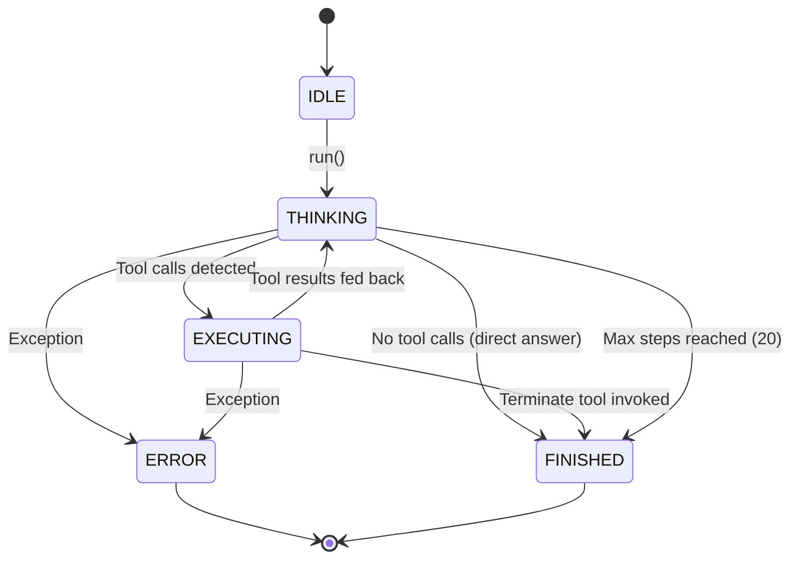
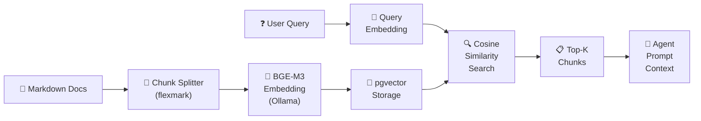

<p align="center">
  
  
  
  
  
  
  
</p>

# JChatMind — AI Agent System

**JChatMind** is a full-stack AI Agent system built on **Spring AI** and **React/TypeScript**. Unlike simple chatbot wrappers, JChatMind implements a genuine **Think–Execute loop** — an autonomous agent runtime that plans multi-step strategies, invokes extensible tools, retrieves knowledge via RAG, and streams every execution state to the frontend in real time over SSE.

---

## Architecture

```
┌─────────────────────────────────────────────────────────────────────────────┐
│                              Frontend (React + TypeScript + Ant Design)     │
│                                                                             │
│   ┌─────────────┐   ┌────────────────┐   ┌──────────────────────────────┐  │
│   │  Chat View   │   │  Agent Config  │   │  Knowledge Base Management   │  │
│   │  (SSE live)  │   │  (CRUD)        │   │  (Upload · Browse · Search)  │  │
│   └──────┬───────┘   └───────┬────────┘   └──────────────┬───────────────┘  │
│          │                   │                            │                  │
│          └───────────────────┼────────────────────────────┘                  │
│                              │  REST / SSE                                  │
└──────────────────────────────┼──────────────────────────────────────────────┘
                               │
┌──────────────────────────────┼──────────────────────────────────────────────┐
│                    Spring Boot Backend (Java 17)                            │
│                              │                                              │
│   ┌──────────────────────────▼──────────────────────────────────────────┐   │
│   │                     Controller Layer (REST API)                     │   │
│   │  AgentController · ChatSessionController · ChatMessageController    │   │
│   │  DocumentController · KnowledgeBaseController · SseController       │   │
│   └──────────────────────────┬──────────────────────────────────────────┘   │
│                              │                                              │
│   ┌──────────────────────────▼──────────────────────────────────────────┐   │
│   │                     Service / Facade Layer                          │   │
│   │  AgentFacadeService · ChatMessageFacadeService · RagService         │   │
│   │  DocumentStorageService · MarkdownParserService · SseService        │   │
│   └────────┬─────────────────┬──────────────────────────┬──────────────┘   │
│            │                 │                          │                   │
│   ┌────────▼───────┐  ┌─────▼──────────────┐  ┌───────▼────────────────┐  │
│   │  Agent Runtime  │  │  Tool System        │  │  RAG Pipeline          │  │
│   │                 │  │                     │  │                        │  │
│   │  ┌───────────┐  │  │  Fixed Tools:       │  │  Markdown → Chunks    │  │
│   │  │  IDLE     │  │  │   • DirectAnswer    │  │  Chunks → Embeddings  │  │
│   │  │    ↓      │  │  │   • Terminate       │  │  (BGE-M3 via Ollama)  │  │
│   │  │ THINKING  │──│  │                     │  │         ↓             │  │
│   │  │    ↓      │  │  │  Optional Tools:    │  │  pgvector Similarity  │  │
│   │  │EXECUTING  │──│  │   • Database Query  │  │  Search (<->)         │  │
│   │  │    ↓      │  │  │   • Email Sender    │  │         ↓             │  │
│   │  │ FINISHED  │  │  │   • File System     │  │  Context Injection    │  │
│   │  │  / ERROR  │  │  │   • Knowledge RAG   │  │  into Agent Prompt    │  │
│   │  └───────────┘  │  │                     │  │                        │  │
│   │ Max 20 steps    │  │  Auto-registration   │  └────────────────────────┘  │
│   │ + timeout guard │  │  via Spring IoC      │                              │
│   └─────────────────┘  └─────────────────────┘                              │
│                              │                                              │
│   ┌──────────────────────────▼──────────────────────────────────────────┐   │
│   │              Multi-Model Registry (ChatClientRegistry)              │   │
│   │         DeepSeek  ←──  Unified ChatClient API  ──→  ZhiPu GLM      │   │
│   │              (extensible — add new models with zero core changes)   │   │
│   └──────────────────────────┬──────────────────────────────────────────┘   │
│                              │                                              │
│   ┌──────────────────────────▼──────────────────────────────────────────┐   │
│   │                Data Layer (MyBatis + PostgreSQL + pgvector)          │   │
│   │  agents · chat_sessions · chat_messages · documents · chunks        │   │
│   │  Custom PgVectorTypeHandler for transparent vector ↔ float[]        │   │
│   └─────────────────────────────────────────────────────────────────────┘   │
└─────────────────────────────────────────────────────────────────────────────┘
```

### Agent Loop — Think-Execute Cycle



### RAG Pipeline Flow



---

## Key Features

### 🔄 Autonomous Agent Loop
A true **Think → Execute → Observe** cycle powered by a state machine (`IDLE → THINKING → EXECUTING → FINISHED | ERROR`). The agent autonomously decides when to invoke tools, when to query knowledge, and when the task is complete — with a configurable **max-step guard** (default: 20) preventing infinite loops.

### 🛠️ Extensible Tool System
Tools are first-class Spring beans, auto-registered via the IoC container:

| Category | Tools | Description |
|----------|-------|-------------|
| **Fixed** (always loaded) | `DirectAnswer`, `Terminate` | Core flow control |
| **Optional** (per-agent) | `DatabaseQuery`, `EmailSender`, `FileSystem`, `KnowledgeRAG` | Domain-specific capabilities |

Adding a new tool is as simple as implementing the `Tool` marker interface and annotating methods with `@Tool` — **zero changes to the core agent loop**.

### 📚 RAG Knowledge Base
End-to-end Retrieval-Augmented Generation pipeline:
- **Ingestion**: Markdown parsing (flexmark) → semantic chunking → embedding via BGE-M3 (Ollama)
- **Storage**: PostgreSQL + pgvector extension with custom `PgVectorTypeHandler` for transparent `float[]` ↔ `vector` mapping
- **Retrieval**: Cosine similarity search (`<->` operator) with ivfflat indexing, supporting 100K+ vectors
- **Context injection**: Top-K chunks are injected directly into the agent's system prompt

### 🔀 Multi-Model Architecture
A **Registry pattern** (`ChatClientRegistry`) decouples model instances from business logic:
- Currently supports **DeepSeek** and **ZhiPu GLM-4**
- Adding a new provider = one `@Bean` method + config entry
- Agents select their model at creation time, enabling per-agent model specialization

### 📡 SSE Real-Time Streaming
Server-Sent Events push every agent state transition and generated message to the frontend in real time:
- `THINKING` → `EXECUTING` → `DONE` lifecycle events
- Tool invocation details and results streamed as they happen
- Lightweight alternative to WebSocket for unidirectional server push

---

## Tech Stack

| Layer | Technology |
|-------|-----------|
| **Backend** | Java 17 · Spring Boot 3.5 · Spring AI 1.1 |
| **AI Models** | DeepSeek · ZhiPu GLM-4 (via Spring AI model starters) |
| **Embeddings** | BGE-M3 (served locally via Ollama) |
| **Database** | PostgreSQL + pgvector · MyBatis |
| **Frontend** | React 19 · TypeScript 5.9 · Ant Design 6 · Vite |
| **Real-Time** | Server-Sent Events (SSE) |
| **Build** | Maven (backend) · npm (frontend) |

---

## Project Structure

```
JChatMind/
├── jchatmind/                    # Spring Boot backend
│   ├── src/main/java/com/kama/jchatmind/
│   │   ├── agent/                # Core agent runtime
│   │   │   ├── JChatMind.java    #   Think-Execute loop engine
│   │   │   ├── JChatMindFactory.java  #   Agent builder / assembler
│   │   │   ├── AgentState.java   #   State machine enum
│   │   │   └── tools/            #   Tool implementations
│   │   │       ├── DataBaseTools.java
│   │   │       ├── EmailTools.java
│   │   │       ├── FileSystemTools.java
│   │   │       ├── KnowledgeTools.java
│   │   │       ├── DirectAnswerTool.java
│   │   │       └── TerminateTool.java
│   │   ├── config/               # Spring configuration
│   │   │   ├── ChatClientRegistry.java     # Multi-model registry
│   │   │   └── MultiChatClientConfig.java  # Model bean definitions
│   │   ├── controller/           # REST API endpoints
│   │   ├── service/              # Business logic (Facade pattern)
│   │   ├── mapper/               # MyBatis data access
│   │   ├── model/                # DTOs, entities, requests, responses
│   │   └── typehandler/          # Custom pgvector ↔ float[] handler
│   └── pom.xml
├── ui/                           # React + TypeScript frontend
│   ├── src/
│   │   ├── components/           # UI components
│   │   │   ├── views/            #   Chat, Agent, Knowledge Base views
│   │   │   ├── modals/           #   Create/edit dialogs
│   │   │   └── tabs/             #   Tab content panels
│   │   ├── api/                  # HTTP client + API definitions
│   │   ├── hooks/                # Custom React hooks
│   │   ├── contexts/             # React context providers
│   │   └── layout/               # App shell (Sidebar + Content)
│   └── package.json
├── jchatmind_assert/             # SQL schemas & seed data
│   ├── jchatmind.sql             #   Core schema (agents, sessions, messages)
│   └── eshop.sql / eshop_data.sql  #   Sample e-shop domain data for RAG demo
├── examples/                     # Standalone HTML demo pages
└── LICENSE                       # MIT
```

---

## Getting Started

### Prerequisites

- **Java 17+** and **Maven 3.8+**
- **Node.js 18+** and **npm**
- **PostgreSQL 15+** with the [pgvector](https://github.com/pgvector/pgvector) extension enabled
- **Ollama** running locally with the `bge-m3` embedding model pulled

### 1. Database Setup

```bash
# Create the database and enable pgvector
psql -U postgres -c "CREATE DATABASE jchatmind;"
psql -U postgres -d jchatmind -c "CREATE EXTENSION IF NOT EXISTS vector;"

# Import schemas
psql -U postgres -d jchatmind -f jchatmind_assert/jchatmind.sql
psql -U postgres -d jchatmind -f jchatmind_assert/eshop.sql
psql -U postgres -d jchatmind -f jchatmind_assert/eshop_data.sql
```

### 2. Configure API Keys

Edit `jchatmind/src/main/resources/application.yaml` with your credentials:

```yaml
spring:
  ai:
    deepseek:
      api-key: YOUR_DEEPSEEK_API_KEY
    zhipuai:
      api-key: YOUR_ZHIPUAI_API_KEY
  datasource:
    url: jdbc:postgresql://localhost:5432/jchatmind
    username: postgres
    password: YOUR_DB_PASSWORD
```

### 3. Start Ollama (for embeddings)

```bash
ollama pull bge-m3
ollama serve   # default port 11434
```

### 4. Run the Backend

```bash
cd jchatmind
./mvnw spring-boot:run
```

The API server starts on `http://localhost:8080`.

### 5. Run the Frontend

```bash
cd ui
npm install
npm run dev
```

The dev server starts on `http://localhost:5173`.

---

## API Overview

| Method | Endpoint | Description |
|--------|----------|-------------|
| `POST` | `/api/agents` | Create a new agent |
| `GET` | `/api/agents` | List all agents |
| `PUT` | `/api/agents/{id}` | Update agent configuration |
| `POST` | `/api/chat-sessions` | Create a new chat session |
| `GET` | `/api/chat-sessions` | List sessions for an agent |
| `POST` | `/api/chat-messages` | Send a user message (triggers agent loop) |
| `GET` | `/api/chat-messages/{sessionId}` | Get message history |
| `GET` | `/api/sse/{sessionId}` | SSE stream for real-time updates |
| `POST` | `/api/knowledge-bases` | Create a knowledge base |
| `POST` | `/api/documents` | Upload a document to a knowledge base |
| `GET` | `/api/tools` | List available tools |

---

## Extending JChatMind

### Adding a New Tool

```java
@Component
public class WeatherTools implements Tool {

    @Override
    public String getName() { return "weather"; }

    @org.springframework.ai.tool.annotation.Tool(
        description = "Get the current weather for a given city"
    )
    public String getWeather(String city) {
        // Call weather API
        return "Sunny, 25°C in " + city;
    }
}
```

Register it as an optional tool in the agent's configuration — no changes to the core loop needed.

### Adding a New Model Provider

```java
// In MultiChatClientConfig.java — just add a new @Bean:
@Bean("gpt-4o")
public ChatClient openAiChatClient(OpenAiChatModel model) {
    return ChatClient.create(model);
}
```

Then reference `"gpt-4o"` as the model name when creating an agent.

---

## Roadmap

- [ ] Multi-language UI support (starting with Chinese localization)
- [ ] Streaming token-by-token output via SSE
- [ ] MCP (Model Context Protocol) integration
- [ ] Conversation branching and history tree
- [ ] Docker Compose one-click deployment
- [ ] Agent-to-agent delegation
- [ ] Fine-grained RBAC and multi-tenancy

---

## License

This project is licensed under the [MIT License](LICENSE).
